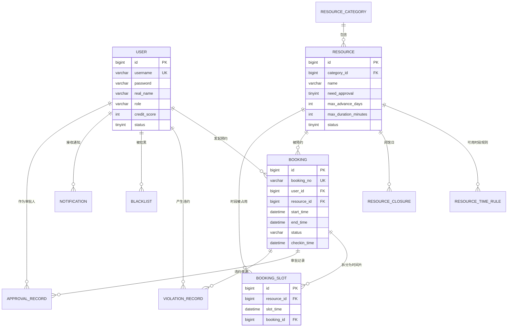

# 项目一数据库设计：校园场地预约系统

> 生成日期：2026-08-12
> 配套文档：`06-项目一详细方案.md`
> 数据库：MySQL 8.0，字符集 utf8mb4

---

## 重要说明：怎么用这份文档

SQL 直接可以执行，但**不要复制粘贴完就完事**。

面试时最常被问的就是"这张表为什么这么设计""这个索引为什么加在这里"。所以正确的用法是：

1. 先读第二部分的 ER 图，理解整体结构
2. 逐张表看 DDL，**每张表下面都写了设计说明和取舍**，看完要能自己复述
3. 执行建库建表
4. 合上文档，尝试自己画出 ER 图并说明每个外键关系的业务含义

如果第 4 步做不到，就回头再读一遍。**理解表结构的成本远低于后面推倒重来的成本。**

---

## 一、整体结构

12 张表，分五个模块：

| 模块 | 表 |
| --- | --- |
| 用户 | `user` |
| 资源 | `resource_category`、`resource`、`resource_time_rule`、`resource_closure` |
| 预约核心 | `booking`、`booking_slot` |
| 流程与约束 | `approval_record`、`violation_record`、`blacklist` |
| 支撑 | `notification`、`operation_log` |

---

## 二、ER 图



**关于外键约束**：DDL 里**不加物理外键**（`FOREIGN KEY`），只在逻辑上维护关系。这是国内互联网公司的普遍做法，理由是物理外键会带来级联删除风险、影响写入性能、增加分库分表的难度。**这一点面试会问，要能说出理由，也要知道另一派观点（物理外键能保证数据完整性，在数据准确性要求极高的金融、政务系统里仍在使用）。**

---

## 三、建库

```sql
CREATE DATABASE IF NOT EXISTS `booking_db`
    DEFAULT CHARACTER SET utf8mb4
    DEFAULT COLLATE utf8mb4_general_ci;

USE `booking_db`;
```

> **为什么是 utf8mb4 而不是 utf8**：MySQL 的 `utf8` 是个历史遗留的假 UTF-8，每个字符最多 3 字节，存不了 emoji 和部分生僻字。`utf8mb4` 才是真正的 UTF-8。这是个经典面试题。

---

## 四、建表 SQL

### 1. `user` 用户表

```sql
CREATE TABLE `user` (
    `id`           BIGINT UNSIGNED NOT NULL AUTO_INCREMENT COMMENT '主键',
    `username`     VARCHAR(50)     NOT NULL                COMMENT '登录账号',
    `password`     VARCHAR(100)    NOT NULL                COMMENT 'BCrypt 加密后的密码',
    `real_name`    VARCHAR(50)     NOT NULL                COMMENT '真实姓名',
    `student_no`   VARCHAR(30)     DEFAULT NULL            COMMENT '学号/工号',
    `phone`        VARCHAR(20)     DEFAULT NULL            COMMENT '手机号',
    `email`        VARCHAR(100)    DEFAULT NULL            COMMENT '邮箱',
    `avatar`       VARCHAR(255)    DEFAULT NULL            COMMENT '头像地址',
    `role`         VARCHAR(20)     NOT NULL DEFAULT 'STUDENT' COMMENT '角色：STUDENT / ADMIN',
    `credit_score` INT             NOT NULL DEFAULT 100    COMMENT '信用分，初始 100',
    `status`       TINYINT         NOT NULL DEFAULT 1      COMMENT '1=正常 0=禁用',
    `deleted`      TINYINT         NOT NULL DEFAULT 0      COMMENT '逻辑删除 0=未删 1=已删',
    `created_at`   DATETIME        NOT NULL DEFAULT CURRENT_TIMESTAMP,
    `updated_at`   DATETIME        NOT NULL DEFAULT CURRENT_TIMESTAMP ON UPDATE CURRENT_TIMESTAMP,
    PRIMARY KEY (`id`),
    UNIQUE KEY `uk_username` (`username`, `deleted`),
    KEY `idx_student_no` (`student_no`),
    KEY `idx_credit_score` (`credit_score`)
) ENGINE = InnoDB
  DEFAULT CHARSET = utf8mb4 COMMENT ='用户表';
```

**设计说明**

- **密码字段长度 100**：BCrypt 加密后固定 60 字符，留出余量。**密码绝不能明文存储，也不能用 MD5**（MD5 可彩虹表碰撞），必须用 BCrypt 这类带盐的慢哈希。这是安全类面试题的送分点。
- **唯一索引为什么是 `(username, deleted)` 而不是 `username`**：因为用了逻辑删除。如果只对 `username` 加唯一索引，一个用户被逻辑删除后，这个用户名就永久无法再注册了。加上 `deleted` 后，已删除的记录不再和新记录冲突。
  **但这个方案有个缺陷**：如果同一个用户名被删除两次，`(username, 1)` 会重复。生产环境更严谨的做法是把 `deleted` 设计成"删除时间戳"（未删除时为 0），这样每次删除的值都不同。**这个取舍讨论本身就是很好的面试素材。**
- **`role` 用字符串而非数字**：可读性好，查数据库时一眼能看懂。角色少的时候这么做没问题；角色多且需要组合权限时应该上 RBAC 三张表（用户-角色-权限）。
- **`credit_score` 加索引**：用于管理员筛选低信用用户（如 `WHERE credit_score < 60`）。
  这里有个容易被追问的点：`credit_score` 是**低基数列**（取值只有 0-100，且绝大多数用户都是 100），按常识"低基数列不该加索引"。但真正决定索引有没有用的是**谓词的选择性**而不是列的基数——低信用用户占比很小，所以 `< 60` 这个条件命中的行极少，优化器会走索引。反过来，如果你想 `ORDER BY credit_score` 对全表排序，这个索引就基本没用。
  **能把"列基数"和"谓词选择性"这两件事分开讲，是索引理解到位的标志。** 如果你的项目里根本没有筛选低信用用户的功能，那就把这个索引删掉——**不要为了简历上好看而加用不到的索引，面试官会问"你这个索引实际被哪个查询用到了"。**

---

### 2. `resource_category` 资源分类表

```sql
CREATE TABLE `resource_category` (
    `id`         BIGINT UNSIGNED NOT NULL AUTO_INCREMENT,
    `name`       VARCHAR(50)     NOT NULL             COMMENT '分类名称',
    `parent_id`  BIGINT UNSIGNED NOT NULL DEFAULT 0   COMMENT '父分类，0 表示顶级',
    `sort_order` INT             NOT NULL DEFAULT 0   COMMENT '排序权重，越小越靠前',
    `icon`       VARCHAR(255)    DEFAULT NULL         COMMENT '图标',
    `deleted`    TINYINT         NOT NULL DEFAULT 0,
    `created_at` DATETIME        NOT NULL DEFAULT CURRENT_TIMESTAMP,
    `updated_at` DATETIME        NOT NULL DEFAULT CURRENT_TIMESTAMP ON UPDATE CURRENT_TIMESTAMP,
    PRIMARY KEY (`id`),
    KEY `idx_parent` (`parent_id`)
) ENGINE = InnoDB
  DEFAULT CHARSET = utf8mb4 COMMENT ='资源分类表';
```

**设计说明**

用 `parent_id` 实现的是**邻接表模型**，最简单，适合层级浅（两三层）的场景。缺点是查询整棵子树需要递归。层级深且要频繁查子树时，可以考虑路径枚举（存 `/1/5/23/`）或闭包表。**面试问到树形结构存储时，能说出这三种方案的对比是加分项。**

---

### 3. `resource` 资源表

```sql
CREATE TABLE `resource` (
    `id`                   BIGINT UNSIGNED NOT NULL AUTO_INCREMENT,
    `category_id`          BIGINT UNSIGNED NOT NULL           COMMENT '所属分类',
    `name`                 VARCHAR(100)    NOT NULL           COMMENT '资源名称，如"琴房 A301"',
    `location`             VARCHAR(200)    DEFAULT NULL       COMMENT '位置描述',
    `capacity`             INT             DEFAULT NULL       COMMENT '容纳人数',
    `description`          TEXT                               COMMENT '详细说明',
    `images`               VARCHAR(1000)   DEFAULT NULL       COMMENT '图片地址，逗号分隔',
    `need_approval`        TINYINT         NOT NULL DEFAULT 0 COMMENT '是否需要审批 1=是 0=否',
    `max_advance_days`     INT             NOT NULL DEFAULT 7 COMMENT '最多可提前几天预约',
    `min_duration_minutes` INT             NOT NULL DEFAULT 30  COMMENT '单次最短时长（分钟）',
    `max_duration_minutes` INT             NOT NULL DEFAULT 120 COMMENT '单次最长时长（分钟）',
    `status`               TINYINT         NOT NULL DEFAULT 1 COMMENT '1=可用 2=维护中 0=停用',
    `deleted`              TINYINT         NOT NULL DEFAULT 0,
    `created_at`           DATETIME        NOT NULL DEFAULT CURRENT_TIMESTAMP,
    `updated_at`           DATETIME        NOT NULL DEFAULT CURRENT_TIMESTAMP ON UPDATE CURRENT_TIMESTAMP,
    PRIMARY KEY (`id`),
    KEY `idx_category_status` (`category_id`, `status`),
    KEY `idx_status` (`status`)
) ENGINE = InnoDB
  DEFAULT CHARSET = utf8mb4 COMMENT ='资源表';
```

**设计说明**

- **规则字段下沉到资源级别**：`max_advance_days`、`max_duration_minutes` 这类规则做成每个资源可独立配置，而不是写死在代码里。球场可能允许提前 14 天预约，琴房只允许 3 天。**"把业务规则做成配置而不是硬编码"是工程成熟度的体现，面试可以主动讲。**
- **`images` 用逗号分隔字符串**：这违反了第一范式，是有意的反范式设计——图片只用于展示、不需要单独查询、数量少（三五张）。如果要按图片做检索或管理，就必须拆成独立的 `resource_image` 表。**要能说清楚这个取舍的边界在哪。**
- **联合索引 `(category_id, status)` 的顺序**：最高频的查询是"某分类下所有可用资源"，两个字段都是等值条件。把 `category_id` 放左边，是因为它的**区分度相对更高**（分类有十几个，而 `status` 只有 3 个取值）。
  **注意措辞要准确**：`category_id` 的区分度只是"比 status 高"，绝对值并不高——几十个资源分到十几个分类里，选择性有限。真正让这个索引有价值的是它避免了全表扫描，而不是它多么精准。**面试时说"category_id 区分度高"会被追问"高到什么程度、你算过选择性吗"，说"相对 status 更高所以放左边"才站得住。**
  按最左前缀原则，这个索引也能支撑只按 `category_id` 查询的场景，**但不能支撑只按 `status` 查询**，所以额外加了 `idx_status`。

---

### 4. `resource_time_rule` 可用时段规则表

```sql
CREATE TABLE `resource_time_rule` (
    `id`          BIGINT UNSIGNED NOT NULL AUTO_INCREMENT,
    `resource_id` BIGINT UNSIGNED NOT NULL          COMMENT '资源 ID',
    `day_of_week` TINYINT         NOT NULL          COMMENT '星期几：1=周一 ... 7=周日',
    `start_time`  TIME            NOT NULL          COMMENT '可预约开始时间，如 08:00',
    `end_time`    TIME            NOT NULL          COMMENT '可预约结束时间，如 22:00',
    `deleted`     TINYINT         NOT NULL DEFAULT 0,
    `created_at`  DATETIME        NOT NULL DEFAULT CURRENT_TIMESTAMP,
    PRIMARY KEY (`id`),
    KEY `idx_resource_day` (`resource_id`, `day_of_week`)
) ENGINE = InnoDB
  DEFAULT CHARSET = utf8mb4 COMMENT ='资源可用时段规则表';
```

**设计说明**

一个资源在不同星期几可以有不同的开放时间（工作日 8:00-22:00，周末 10:00-18:00），一天也可以有多个时段（上午场 + 下午场，中间闭馆）。所以是一对多。

用 `TIME` 类型而不是 `VARCHAR` 存时间，可以直接做时间比较运算，且占用空间小。

---

### 5. `resource_closure` 闭馆日表

```sql
CREATE TABLE `resource_closure` (
    `id`           BIGINT UNSIGNED NOT NULL AUTO_INCREMENT,
    `resource_id`  BIGINT UNSIGNED NOT NULL       COMMENT '资源 ID，0 表示全部资源（如法定节假日）',
    `closure_date` DATE            NOT NULL       COMMENT '闭馆日期',
    `reason`       VARCHAR(200)    DEFAULT NULL   COMMENT '原因',
    `created_at`   DATETIME        NOT NULL DEFAULT CURRENT_TIMESTAMP,
    PRIMARY KEY (`id`),
    UNIQUE KEY `uk_resource_date` (`resource_id`, `closure_date`)
) ENGINE = InnoDB
  DEFAULT CHARSET = utf8mb4 COMMENT ='闭馆日表';
```

**设计说明**

`resource_id = 0` 表示全局闭馆，用一个特殊值避免为"全局规则"单独建一张表。这是一个常见的实用技巧，但要在代码和注释里明确约定，否则后来的维护者会踩坑。

唯一索引防止同一资源同一天被重复设置闭馆。

---

### 6. `booking` 预约主表

```sql
CREATE TABLE `booking` (
    `id`             BIGINT UNSIGNED NOT NULL AUTO_INCREMENT,
    `booking_no`     VARCHAR(32)     NOT NULL          COMMENT '业务单号，对外展示',
    `user_id`        BIGINT UNSIGNED NOT NULL          COMMENT '预约人',
    `resource_id`    BIGINT UNSIGNED NOT NULL          COMMENT '资源',
    `start_time`     DATETIME        NOT NULL          COMMENT '开始时间',
    `end_time`       DATETIME        NOT NULL          COMMENT '结束时间',
    `purpose`        VARCHAR(500)    DEFAULT NULL      COMMENT '用途说明',
    `attendee_count` INT             DEFAULT NULL      COMMENT '预计参与人数',
    `status`         VARCHAR(20)     NOT NULL          COMMENT '状态机，见下方说明',
    `checkin_time`   DATETIME        DEFAULT NULL      COMMENT '实际签到时间',
    `cancel_time`    DATETIME        DEFAULT NULL      COMMENT '取消时间',
    `cancel_reason`  VARCHAR(200)    DEFAULT NULL      COMMENT '取消原因',
    `deleted`        TINYINT         NOT NULL DEFAULT 0,
    `created_at`     DATETIME        NOT NULL DEFAULT CURRENT_TIMESTAMP,
    `updated_at`     DATETIME        NOT NULL DEFAULT CURRENT_TIMESTAMP ON UPDATE CURRENT_TIMESTAMP,
    PRIMARY KEY (`id`),
    UNIQUE KEY `uk_booking_no` (`booking_no`),
    KEY `idx_user_status` (`user_id`, `status`),
    KEY `idx_resource_start` (`resource_id`, `start_time`),
    KEY `idx_status_start` (`status`, `start_time`)
) ENGINE = InnoDB
  DEFAULT CHARSET = utf8mb4 COMMENT ='预约主表';
```

**状态机**

```
                    ┌──> REJECTED（管理员驳回）
PENDING_APPROVAL ───┼──> CANCELLED（用户在审批前自行取消）
（待审批）           │
                    └──> CONFIRMED ──> CHECKED_IN ──> COMPLETED
                          （已确认）  │   （已签到）      （已完成）
                                      ├──> CANCELLED（用户取消）
                                      └──> NO_SHOW（超时未签到，系统自动置位）
```

不需要审批的资源，创建后直接进入 `CONFIRMED`。

**两个实现时容易漏的点**：

- **`PENDING_APPROVAL` 也可以被用户取消**，不是只有 `CONFIRMED` 才能取消。很多人只实现了后者。
- **进入 `CANCELLED` / `REJECTED` / `NO_SHOW` 这三个终态时，都必须同步删除 `booking_slot` 记录**释放时段，否则时段会被永久占死。建议把"改状态 + 删 slot"封装成一个方法，在同一个事务里执行，杜绝漏删。

**设计说明**

- **为什么要 `booking_no` 而不是直接用自增 `id`**：自增 ID 会暴露业务量（别人从订单号能推算出你一天有多少预约），也不利于分库分表。业务单号可以用"日期 + 随机数"或雪花算法生成。**这是电商类系统的标准做法，面试常问。**
- **三个索引各自服务什么查询**：
  - `idx_user_status` → "我的预约列表，筛选进行中的"
  - `idx_resource_start` → "某资源某时间段的预约情况"
  - `idx_status_start` → **定时任务专用**：扫描"状态是 CONFIRMED 且开始时间已过 15 分钟"的记录。没有这个索引，定时任务就是全表扫描，数据量一大就拖垮数据库。**能主动指出"这个索引是为定时任务建的"，是很扎实的表现。**
- **`status` 用字符串枚举**：可读性优先。数据量极大时用 TINYINT 更省空间，这是个可以讨论的取舍。

---

### 7. `booking_slot` 时段占用表 ⭐ 核心设计

```sql
CREATE TABLE `booking_slot` (
    `id`          BIGINT UNSIGNED NOT NULL AUTO_INCREMENT,
    `resource_id` BIGINT UNSIGNED NOT NULL COMMENT '资源 ID',
    `slot_time`   DATETIME        NOT NULL COMMENT '时间片起点，30 分钟粒度对齐',
    `booking_id`  BIGINT UNSIGNED NOT NULL COMMENT '归属的预约 ID',
    `created_at`  DATETIME        NOT NULL DEFAULT CURRENT_TIMESTAMP,
    PRIMARY KEY (`id`),
    UNIQUE KEY `uk_resource_slot` (`resource_id`, `slot_time`),
    KEY `idx_booking` (`booking_id`)
) ENGINE = InnoDB
  DEFAULT CHARSET = utf8mb4 COMMENT ='时段占用表——并发控制的核心，唯一索引保证同一资源同一时间片只能被占用一次';
```

**这是整个项目最重要的一张表，面试时要能讲透。**

**它解决什么问题**

同一资源同一时段只能被一个人预约。但时间是**区间**，而数据库的唯一约束只能约束**相等**——已有 14:00-16:00 的预约，新来的 15:00-17:00 起止时间都不同，唯一索引拦不住，但它们实际重叠了。

**解法：把连续区间离散化成固定粒度的时间片，把"区间重叠"问题转化为"离散值冲突"问题。**

预约 14:00-16:00，就往这张表插 4 条记录：`14:00`、`14:30`、`15:00`、`15:30`。
另一个人要订 15:00-17:00，需要插 `15:00`、`15:30`、`16:00`、`16:30`，其中前两个已被占用，数据库直接抛 `DuplicateKeyException`，事务回滚。

```java
@Transactional(rollbackFor = Exception.class)
public BookingVO createBooking(BookingDTO dto) {
    validateRules(dto);
    Booking booking = buildBooking(dto);
    bookingMapper.insert(booking);
    try {
        bookingSlotMapper.insertBatch(splitToSlots(booking));
    } catch (DuplicateKeyException e) {
        throw new BizException("该时段已被预约，请刷新后重试");
    }
    return toVO(booking);
}
```

**五个必须记住的要点**

1. **这张表不能用逻辑删除。** 取消预约时必须**物理删除**对应的 slot 记录，否则唯一索引会永久占住这个时段，别人再也订不了。这是实现时最容易踩的坑。
   同理，**预约被置为 `CANCELLED`、`REJECTED`、`NO_SHOW` 时都要删除对应 slot**——尤其是 `NO_SHOW`，人没来，时段就该释放出去。定时核销任务里很容易只改了 `booking.status` 而忘了删 slot。

2. **这个方案有一条前置约束：预约的起止时间必须对齐到 30 分钟边界。**
   如果允许用户预约 14:15-15:15，它跨越了 14:00 和 15:00 两个时间片的一部分，整个离散化方案就失效了——你无法用"占用哪几个片"来精确表达它。
   **所以必须在 `validateRules()` 里强制校验**：`start_time` 和 `end_time` 的分钟数只能是 00 或 30，秒和毫秒必须为 0。前端的时间选择器也要相应地只提供整点和半点选项。
   这条约束是**离散化方案的代价**，要能主动说出来：你用"损失一部分预约灵活性"换来了"并发正确性由数据库保证"。面试官问"如果业务要求支持任意时间预约怎么办"，答案是把粒度降到 5 分钟或 1 分钟（写放大变大），或者改用 PostgreSQL 的 `tstzrange` + 排他约束（`EXCLUDE USING gist`）——**后者是数据库层面对区间重叠的原生支持，MySQL 没有，这个对比很加分。**
2. **粒度是业务决策**。选 30 分钟是因为校园场景没有更细的需求。粒度越细，单次预约产生的记录越多（写放大越严重）；粒度越粗，可预约的灵活性越差。要能说出这个权衡。
3. **它同时解决了查询问题**。查"某资源某天哪些时段已被占用"，变成一个简单的等值范围查询，走 `uk_resource_slot` 索引，性能极好——不需要做任何区间重叠计算。
4. **它是正确性的最后防线**。上层可以加 Redis 分布式锁来减少无效请求，但**锁是性能优化，数据库唯一约束才是正确性保证**。Redis 主从切换、锁超时提前释放、Redis 宕机等极端情况下，锁会失效，这时候只有数据库约束能救你。

---

### 8. `approval_record` 审批记录表

```sql
CREATE TABLE `approval_record` (
    `id`          BIGINT UNSIGNED NOT NULL AUTO_INCREMENT,
    `booking_id`  BIGINT UNSIGNED NOT NULL      COMMENT '预约 ID',
    `approver_id` BIGINT UNSIGNED NOT NULL      COMMENT '审批人',
    `action`      VARCHAR(20)     NOT NULL      COMMENT 'APPROVE=通过 REJECT=驳回',
    `comment`     VARCHAR(500)    DEFAULT NULL  COMMENT '审批意见',
    `created_at`  DATETIME        NOT NULL DEFAULT CURRENT_TIMESTAMP,
    PRIMARY KEY (`id`),
    KEY `idx_booking` (`booking_id`),
    KEY `idx_approver` (`approver_id`)
) ENGINE = InnoDB
  DEFAULT CHARSET = utf8mb4 COMMENT ='审批记录表';
```

**设计说明**：审批结果没有直接写在 `booking` 表的字段里，而是单独建表，因为**审批是需要留痕的行为**——谁在什么时间做了什么决定、意见是什么，都要可追溯。这类"流水表/日志表"只插不改，是审计的基础。

---

### 9. `violation_record` 违约记录表

```sql
CREATE TABLE `violation_record` (
    `id`             BIGINT UNSIGNED NOT NULL AUTO_INCREMENT,
    `user_id`        BIGINT UNSIGNED NOT NULL      COMMENT '违约用户',
    `booking_id`     BIGINT UNSIGNED NOT NULL      COMMENT '关联预约',
    `violation_type` VARCHAR(30)     NOT NULL      COMMENT 'NO_SHOW=未到 LATE_CANCEL=晚取消',
    `score_change`   INT             NOT NULL      COMMENT '信用分变动，负数表示扣分',
    `remark`         VARCHAR(200)    DEFAULT NULL,
    `created_at`     DATETIME        NOT NULL DEFAULT CURRENT_TIMESTAMP,
    PRIMARY KEY (`id`),
    UNIQUE KEY `uk_booking_type` (`booking_id`, `violation_type`),
    KEY `idx_user_time` (`user_id`, `created_at`)
) ENGINE = InnoDB
  DEFAULT CHARSET = utf8mb4 COMMENT ='违约记录表';
```

**设计说明**

`uk_booking_type` 这个唯一索引是**定时任务幂等性的保障**。自动核销任务如果因为重启、并发或重试而重复执行，第二次插入违约记录会因唯一键冲突而失败，从而避免同一次违约被重复扣分。

**但这个保障有个前提，容易被忽略**：插入违约记录和扣减 `user.credit_score` **必须在同一个事务里**。如果扣分先提交、插记录后失败，唯一约束就白设了——用户会被重复扣分。正确的顺序是把两个操作包在一个 `@Transactional` 方法里，让唯一键冲突触发整体回滚。

**"用数据库唯一约束实现幂等"是一个非常实用且面试友好的技巧**，比在代码里写各种判断可靠得多。面试时如果能主动补一句"前提是相关的副作用必须和这条唯一记录在同一事务内"，会显得你真的踩过这个坑。

---

### 10. `blacklist` 黑名单表

```sql
CREATE TABLE `blacklist` (
    `id`          BIGINT UNSIGNED NOT NULL AUTO_INCREMENT,
    `user_id`     BIGINT UNSIGNED NOT NULL      COMMENT '用户',
    `reason`      VARCHAR(200)    NOT NULL      COMMENT '拉黑原因',
    `start_date`  DATE            NOT NULL      COMMENT '生效日期',
    `end_date`    DATE            NOT NULL      COMMENT '解除日期',
    `operator_id` BIGINT UNSIGNED DEFAULT NULL  COMMENT '操作人，系统自动为 NULL',
    `created_at`  DATETIME        NOT NULL DEFAULT CURRENT_TIMESTAMP,
    PRIMARY KEY (`id`),
    KEY `idx_user_end` (`user_id`, `end_date`)
) ENGINE = InnoDB
  DEFAULT CHARSET = utf8mb4 COMMENT ='黑名单表';
```

**设计说明**

不在 `user` 表加一个 `is_blacklist` 字段，而是单独建表，原因是：黑名单有起止时间、有原因、有操作人、会多次发生，是一段有生命周期的记录而不是一个状态位。

判断用户当前是否被拉黑，**两个日期条件都要写**：

```sql
SELECT COUNT(*) FROM blacklist
WHERE user_id = ?
  AND start_date <= CURDATE()
  AND end_date   >= CURDATE();
```

**只写 `end_date >= CURDATE()` 是个真实会踩的 bug**：管理员可以录入一条将来才生效的处罚（比如下周开始禁用两周），漏掉 `start_date` 条件会让这个人从录入那一刻就被误判为已拉黑。

索引方面，`idx_user_end (user_id, end_date)` 能让 `user_id` 走等值、`end_date` 走范围；`start_date` 因为排在范围条件之后，只能在回表后过滤，这是可以接受的——**范围条件之后的列用不上索引，这正是最左前缀原则的经典体现，面试可以主动讲。**

---

### 11. `notification` 通知表

```sql
CREATE TABLE `notification` (
    `id`         BIGINT UNSIGNED NOT NULL AUTO_INCREMENT,
    `user_id`    BIGINT UNSIGNED NOT NULL      COMMENT '接收人',
    `title`      VARCHAR(100)    NOT NULL,
    `content`    VARCHAR(1000)   NOT NULL,
    `type`       VARCHAR(30)     NOT NULL      COMMENT 'BOOKING_APPROVED / REMIND / VIOLATION 等',
    `biz_id`     BIGINT UNSIGNED DEFAULT NULL  COMMENT '关联业务 ID，用于点击跳转',
    `is_read`    TINYINT         NOT NULL DEFAULT 0,
    `created_at` DATETIME        NOT NULL DEFAULT CURRENT_TIMESTAMP,
    PRIMARY KEY (`id`),
    KEY `idx_user_read_time` (`user_id`, `is_read`, `created_at`)
) ENGINE = InnoDB
  DEFAULT CHARSET = utf8mb4 COMMENT ='站内通知表';
```

**设计说明**：`idx_user_read_time` 是为最高频的查询"我的未读通知，按时间倒序"设计的三字段联合索引，能同时完成过滤和排序，避免额外的 filesort。**"让索引同时覆盖 WHERE 和 ORDER BY"是索引优化的重要技巧。**

---

### 12. `operation_log` 操作日志表

```sql
CREATE TABLE `operation_log` (
    `id`         BIGINT UNSIGNED NOT NULL AUTO_INCREMENT,
    `user_id`    BIGINT UNSIGNED DEFAULT NULL COMMENT '操作人，未登录为 NULL',
    `module`     VARCHAR(50)     NOT NULL     COMMENT '模块名',
    `operation`  VARCHAR(100)    NOT NULL     COMMENT '操作描述',
    `method`     VARCHAR(200)    DEFAULT NULL COMMENT '类名.方法名',
    `params`     TEXT                         COMMENT '请求参数 JSON',
    `ip`         VARCHAR(50)     DEFAULT NULL,
    `cost_ms`    BIGINT          DEFAULT NULL COMMENT '耗时（毫秒）',
    `success`    TINYINT         NOT NULL DEFAULT 1,
    `error_msg`  VARCHAR(1000)   DEFAULT NULL,
    `created_at` DATETIME        NOT NULL DEFAULT CURRENT_TIMESTAMP,
    PRIMARY KEY (`id`),
    KEY `idx_user_time` (`user_id`, `created_at`),
    KEY `idx_created_at` (`created_at`)
) ENGINE = InnoDB
  DEFAULT CHARSET = utf8mb4 COMMENT ='操作日志表';
```

**设计说明**

这张表通过 **AOP 自动写入**，不需要在业务代码里手动记录。它本身就是 AOP 最经典的应用场景，实现一遍就彻底理解 AOP 是干什么的了。

`cost_ms` 字段有额外价值：它是你后期做性能分析的数据来源，能直接查出"最慢的 10 个接口"。**简历上写"通过 AOP 埋点定位到 XX 接口平均耗时 800ms，优化后降至 120ms"，数据就来自这张表。**

日志表增长很快，生产环境需要定期归档或按月分表，这一点要知道。

---

## 五、初始化测试数据

```sql
-- 管理员账号（密码需用 BCrypt 加密后替换，这里是占位）
INSERT INTO `user` (`username`, `password`, `real_name`, `role`, `credit_score`)
VALUES ('admin', '$2a$10$REPLACE_WITH_BCRYPT_HASH', '系统管理员', 'ADMIN', 100),
       ('student01', '$2a$10$REPLACE_WITH_BCRYPT_HASH', '张三', 'STUDENT', 100),
       ('student02', '$2a$10$REPLACE_WITH_BCRYPT_HASH', '李四', 'STUDENT', 100);

-- 资源分类
INSERT INTO `resource_category` (`id`, `name`, `parent_id`, `sort_order`)
VALUES (1, '教学场地', 0, 1),
       (2, '文体场地', 0, 2),
       (3, '设备器材', 0, 3),
       (4, '研讨室', 1, 1),
       (5, '琴房', 2, 1),
       (6, '球场', 2, 2);

-- 资源
INSERT INTO `resource` (`category_id`, `name`, `location`, `capacity`,
                        `need_approval`, `max_advance_days`, `max_duration_minutes`)
VALUES (4, '研讨室 A301', '图书馆三楼', 10, 0, 7, 180),
       (4, '研讨室 A302', '图书馆三楼', 20, 1, 14, 240),
       (5, '琴房 B101', '艺术楼一楼', 1, 0, 3, 120),
       (6, '篮球场 1 号', '体育馆东侧', 20, 0, 7, 120);

-- 可用时段：研讨室 A301（resource_id=1），工作日 08:00-22:00，周末 10:00-18:00
INSERT INTO `resource_time_rule` (`resource_id`, `day_of_week`, `start_time`, `end_time`)
VALUES (1, 1, '08:00:00', '22:00:00'),
       (1, 2, '08:00:00', '22:00:00'),
       (1, 3, '08:00:00', '22:00:00'),
       (1, 4, '08:00:00', '22:00:00'),
       (1, 5, '08:00:00', '22:00:00'),
       (1, 6, '10:00:00', '18:00:00'),
       (1, 7, '10:00:00', '18:00:00');
```

> **密码怎么生成**：写一个测试方法调用 `new BCryptPasswordEncoder().encode("123456")`，把输出的哈希串填进去。**不要在生产数据里放弱密码。**

---

## 六、验证清单

建完表后，自查这几项：

- [ ] 12 张表全部创建成功，字符集都是 utf8mb4
- [ ] 能说出每张表的业务作用
- [ ] 能解释 `booking_slot` 为什么存在、为什么不能逻辑删除
- [ ] **知道预约时间必须对齐 30 分钟边界，并已在校验逻辑里落实**
- [ ] **知道进入 `CANCELLED` / `REJECTED` / `NO_SHOW` 三个终态时都要删除 slot 释放时段**
- [ ] 能解释每个联合索引的字段顺序为什么这样排
- [ ] 能说出 `uk_booking_type` 和幂等性的关系，**以及"副作用必须同事务"这个前提**
- [ ] **黑名单查询同时写了 `start_date` 和 `end_date` 两个条件**
- [ ] 能说出不加物理外键的理由，以及反方观点
- [ ] 用 DBeaver 的 ER 图功能生成一张图，和本文档的 Mermaid 图对照

---

## 七、后续可能的演进（面试可以主动提）

面试官问"如果用户量涨到十万，你这个设计会有什么问题"，可以答：

1. **`booking_slot` 会成为写入热点**。热门资源的时间片集中，可能出现锁竞争。方案是按 `resource_id` 分片，或者引入 Redis 预扣减把冲突拦在数据库之前。
2. **`operation_log` 增长过快**。方案是按月分表，或者改为写入 Elasticsearch。
3. **历史预约数据归档**。已完成超过一年的预约迁到历史表，保持主表精简。
4. **信用分的计算**。现在是实时扣分，如果规则变复杂（比如按时间窗口滚动计算），应该改为事件驱动 + 异步计算。

**主动说出系统的局限性和演进方向，比假装系统完美要加分得多。**
